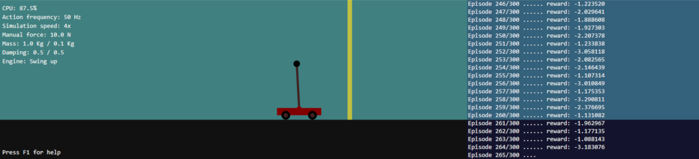

# Learning Cart-Pole Swing-Up Control with DDPG

This is a demonstration of solving the cart-pole swing-up problem through Deep Deterministic Gradient Policy (DDPG). The algorithmn is implemented as an engine for the [cartpole-simulator](https://github.com/DomenSoberl/cartpole-simulator). Reinforcement learning is implemented using the [Deep-C](https://github.com/DomenSoberl/deep-c) library.

## The problem definition

The task is to learn how to swing up the pendulum that is attached to a cart. The cart can be moved along one dimension - left or right. This movement also affects the pendulum, and with a sufficient force, it can be made to swing and eventually lift to a vertical position, where it should be held for as long as possible. This problem is more difficult than swinging up a simple pendulum, because the movement of the cart affects the pendulum differently if the pendulum is facing downward than if facing upward, e.g., accelerating to the left makes the pendulum rotate CW when up, and CCW when down.

An episode starts with a random downward facing pendulum position (theta = 180° +/- 90°). The goal is to lift the pendulum vertically up (theta = 0°) and keep it there. The duration of one episode is 300 steps, after which the simulation is reset. The algorithm learns to swing up the pendulum after about 200 - 250 episodes. We train it for 300 episodes.

## Building and running the simulation

Make sure to clone the repository with all its submodules:

`git clone https://github.com/DomenSoberl/swing-up.git --recurse-submodules`

Open the `swing-up.sln` solution in Visual Studio and execute the *build* command. Building with *Release* configuration is advised for a faster binary code. The program can be run directly from Visual Studio after being built. As a stand-alone program, the following two files should be distributed together:

- `./deps/cartpole-simulator/bin/x64/Release/cartpole.exe`
- `./lib/x64/Release/cartpole.dll`

If building the *Debug* or the *Win32* version, the paths to the two files are changed accordingly with the standard Visual Studio output folder naming.

To study the algorithm or make changes, explore the `./swing-up/source` folder.

## Acnowledgements

If you find this code useful in your project/publication, please add an acknowledgements to this page.